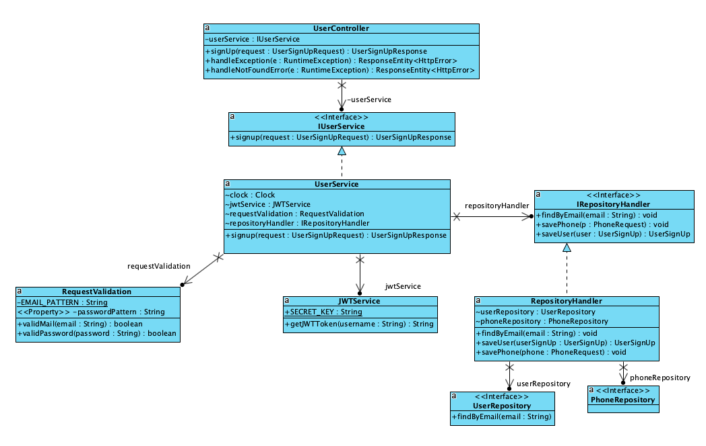

# Spring Boot User Service  Project


## How to Run

Run the service with these command line options:

```
 ./gradlew build test

```
 add this should be the response:
```
BUILD SUCCESSFUL in 8s
5 actionable tasks: 1 executed, 4 up-to-date

```

and then start the application:

```
./gradlew bootRun

```
verify the application is running successfully:
```
2023-11-23 20:17:26.440  INFO 3127 --- [           main] o.s.b.w.embedded.tomcat.TomcatWebServer  : Tomcat started on port(s): 8080 (http) with context path ''
2023-11-23 20:17:26.441  INFO 3127 --- [           main] d.s.w.p.DocumentationPluginsBootstrapper : Context refreshed
2023-11-23 20:17:26.451  INFO 3127 --- [           main] d.s.w.p.DocumentationPluginsBootstrapper : Found 1 custom documentation plugin(s)
2023-11-23 20:17:26.467  INFO 3127 --- [           main] s.d.s.w.s.ApiListingReferenceScanner     : Scanning for api listing references
2023-11-23 20:17:26.521  INFO 3127 --- [         task-1] o.h.e.t.j.p.i.JtaPlatformInitiator       : HHH000490: Using JtaPlatform implementation: [org.hibernate.engine.transaction.jta.platform.internal.NoJtaPlatform]
2023-11-23 20:17:26.524  INFO 3127 --- [         task-1] j.LocalContainerEntityManagerFactoryBean : Initialized JPA EntityManagerFactory for persistence unit 'default'
2023-11-23 20:17:26.534  INFO 3127 --- [           main] DeferredRepositoryInitializationListener : Triggering deferred initialization of Spring Data repositories…
2023-11-23 20:17:26.659  INFO 3127 --- [           main] DeferredRepositoryInitializationListener : Spring Data repositories initialized!
2023-11-23 20:17:26.666  INFO 3127 --- [           main] c.t.userservice.UserServiceApplication   : Started UserServiceApplication in 1.651 seconds (JVM running for 1.902)


```


## About the Service

### Get information about endpoint.

Run the server and browse to
[swagger-ui](http://localhost:8080/swagger-ui.html)

### UML Class Diagram



